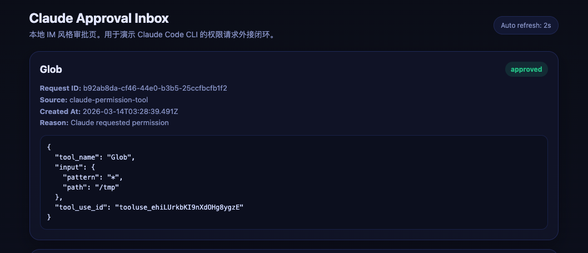
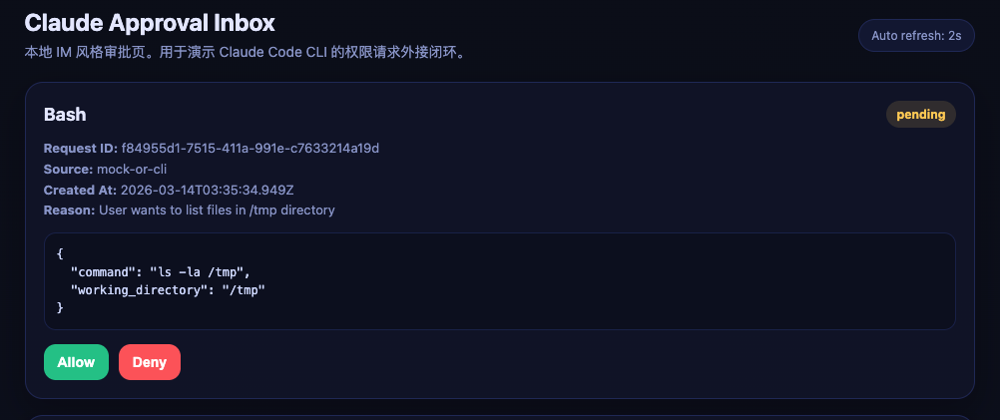
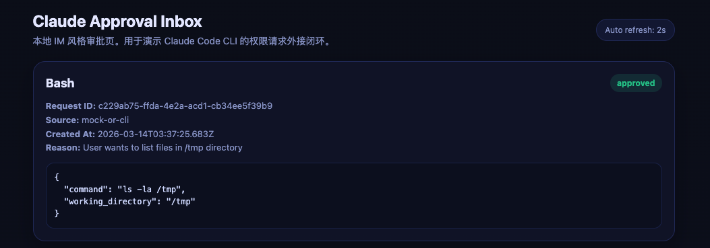
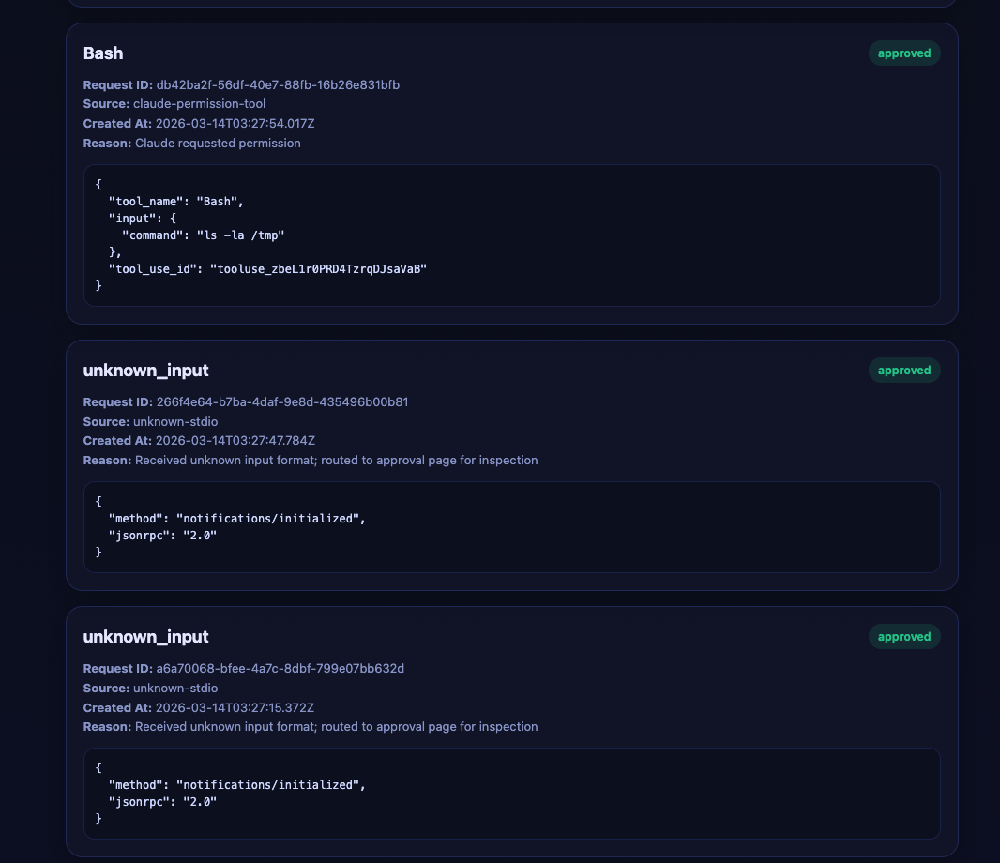

# Claude CLI Approval POC

一个可复现的闭环 POC，演示如何通过本地网页对 Claude Code CLI 的权限请求进行审批。

## 🎯 核心功能

- **本地审批网页**：IM 风格的审批界面，实时显示权限请求
- **MCP 协议支持**：完整实现 MCP (Model Context Protocol) 服务器
- **轮询机制**：自动等待用户审批决策，无需手动刷新
- **Mock 模式**：无需 Claude CLI 即可测试完整流程

## 🏗️ 架构说明

```
┌─────────────────┐
│  Claude CLI     │  用户发起任务
│  (或 Mock)      │
└────────┬────────┘
         │ stdio (JSON-RPC)
         ↓
┌─────────────────────────┐
│ mcp-approval-server.mjs │  MCP 协议服务器
│ (权限请求处理)           │  - 接收 Claude 权限请求
└────────┬────────────────┘  - 转发到审批服务器
         │ HTTP API          - 轮询等待决策
         ↓
┌─────────────────────────┐
│   web-server.mjs        │  Web 服务器
│   (审批界面 + API)       │  - 展示审批卡片
└─────────────────────────┘  - 处理用户决策
         ↑
         │ 浏览器访问
    用户点击 Allow/Deny
```

## 📋 前置条件

### 必需
- Node.js 18+
- npm

### 可选（运行真实 Claude 时需要）
- 已安装 [Claude Code CLI](https://docs.anthropic.com/en/docs/claude-code)
- 已完成 Claude 登录认证

## 🎬 效果演示

### 审批界面


> 待补充：审批页面的初始状态，显示"暂无请求"的空状态

### Mock 测试流程

```
❯   npm run run:mock

> claude-cli-approval-poc@1.0.0 run:mock
> node run-mock.mjs

Starting mock approval test...
This will send a test permission request to the approval server.


Sending test request:
{
  "type": "permission_request",
  "tool_name": "Bash",
  "reason": "User wants to list files in /tmp directory",
  "payload": {
    "command": "ls -la /tmp",
    "working_directory": "/tmp"
  }
}

Please open http://localhost:3131 to approve or deny this request.
```


> 待补充：浏览器中显示的权限请求卡片，包含工具名称、原因、payload 等信息


> 待补充：点击 Allow/Deny 后，终端显示的审批结果

### Claude CLI 真实运行

```
claude -p --mcp-config ./mcp-config.json --permission-prompt-tool mcp__approval-server__permission_prompt "Please inspect the /tmp
  directory"
/tmp 目录包含一个`Claude-to-IM-skill` 项目，这是一个 Node.js 项目，包含：

- node_modules 依赖包
- .agents/skills/claude-to-im 子目录结构

这看起来是一个 Claude 技能项目，用于与即时通讯工具集成，包含 Discord.js 相关依赖。
```



### 完整交互流程

```
┌─────────────────────────────────────────────────────────────┐
│ 1. 启动服务器                                                │
│    $ npm start                                              │
│    → 服务器运行在 http://localhost:3131                      │
└─────────────────────────────────────────────────────────────┘
                            ↓
┌─────────────────────────────────────────────────────────────┐
│ 2. 打开浏览器                                                │
│    访问 http://localhost:3131                               │
│    → 显示空状态："暂无请求"                                   │
└─────────────────────────────────────────────────────────────┘
                            ↓
┌─────────────────────────────────────────────────────────────┐
│ 3. 触发权限请求                                              │
│    $ npm run run:claude                                     │
│    → Claude 开始执行任务                                      │
└─────────────────────────────────────────────────────────────┘
                            ↓
┌─────────────────────────────────────────────────────────────┐
│ 4. 审批页面自动刷新                                           │
│    → 显示权限请求卡片                                         │
│    → 包含：工具名、原因、命令详情                              │
└─────────────────────────────────────────────────────────────┘
                            ↓
┌─────────────────────────────────────────────────────────────┐
│ 5. 用户审批                                                  │
│    点击 [Allow] 或 [Deny]                                   │
│    → 决策立即生效                                            │
└─────────────────────────────────────────────────────────────┘
                            ↓
┌─────────────────────────────────────────────────────────────┐
│ 6. Claude 继续执行                                           │
│    → Allow: 执行命令并返回结果                                │
│    → Deny: 报告权限被拒绝                                     │
└─────────────────────────────────────────────────────────────┘
```

## 🚀 快速开始

### 1. 安装依赖

```bash
npm install
```

### 2. 启动审批服务器

```bash
npm start
```

服务器将在 http://localhost:3131 启动。在浏览器中打开此地址查看审批界面。

### 3. 测试 Mock 模式（推荐先测试）

在**新终端**运行：

```bash
npm run run:mock
```

这会发送一个测试权限请求到审批页面。在浏览器中点击 **Allow** 或 **Deny** 完成审批。

### 4. 运行真实 Claude CLI

确保已安装并登录 Claude CLI，然后在**新终端**运行：

```bash
npm run run:claude
```

Claude 会尝试执行任务，当需要权限时会将请求发送到审批页面。

## 📖 使用说明

### 交互流程

1. **启动服务器**：`npm start` 保持运行
2. **打开审批页面**：浏览器访问 http://localhost:3131
3. **触发权限请求**：运行 `npm run run:claude` 或 `npm run run:mock`
4. **审批操作**：
   - 审批页面会自动刷新（每 2 秒）
   - 显示权限请求卡片，包含工具名称、原因、详细参数
   - 点击 **Allow** 允许执行，或 **Deny** 拒绝执行
5. **查看结果**：Claude CLI 终端会显示执行结果

### 手动运行 Claude CLI

```bash
claude -p \
  --mcp-config ./mcp-config.json \
  --permission-prompt-tool mcp__approval-server__permission_prompt \
  "Please inspect the /tmp directory"
```

**参数说明：**
- `-p`：启用权限提示模式
- `--mcp-config`：指定 MCP 配置文件
- `--permission-prompt-tool`：指定权限审批工具（完整名称格式：`mcp__<服务器名>__<工具名>`）

## 📁 项目结构

```
├── mcp-config.json          # MCP 服务器配置
├── web-server.mjs           # 审批网页服务器（Express + REST API）
├── mcp-approval-server.mjs  # MCP 协议处理器（stdio 通信）
├── run-claude.mjs           # Claude CLI 启动脚本
├── run-mock.mjs             # Mock 测试脚本
├── package.json             # 项目配置
└── README.md                # 本文档
```

### 核心文件说明

#### mcp-config.json
定义 MCP 服务器配置，注册 `approval-server` 服务：
```json
{
  "mcpServers": {
    "approval-server": {
      "command": "node",
      "args": ["./mcp-approval-server.mjs"],
      "env": {
        "APPROVAL_WEB_BASE": "http://localhost:3131"
      }
    }
  }
}
```

#### mcp-approval-server.mjs
实现 MCP 协议的 stdio 服务器，支持：
- `initialize`：初始化握手
- `tools/list`：列出可用工具
- `tools/call`：处理工具调用（权限请求）

#### web-server.mjs
提供 Web 界面和 REST API，支持：
- 创建审批请求
- 查询请求列表
- 提交审批决策
- 轮询等待结果

## 🔌 API 接口

### POST /api/requests
创建新的审批请求

**请求体：**
```json
{
  "source": "claude-permission-tool",
  "tool_name": "Bash",
  "reason": "User wants to list files",
  "payload": {
    "command": "ls -la /tmp"
  }
}
```

**响应：**
```json
{
  "ok": true,
  "id": "uuid-here"
}
```

### GET /api/requests
获取所有审批请求列表

### GET /api/requests/:id
获取单个审批请求详情

### POST /api/requests/:id/decision
提交审批决策

**请求体：**
```json
{
  "action": "allow"  // 或 "deny"
}
```

### GET /api/requests/:id/wait
轮询等待审批结果（长轮询）

## ⚙️ 环境变量

- `APPROVAL_WEB_BASE`：审批服务器地址，默认 `http://localhost:3131`

## 🔧 故障排查

### Claude CLI 无输出
- 确保 `npm start` 正在运行
- 检查 Claude CLI 是否已安装：`claude --version`
- 检查 Claude CLI 是否已登录：`claude auth status`

### MCP 工具未找到
- 确保使用完整工具名称：`mcp__approval-server__permission_prompt`
- 检查 `mcp-config.json` 配置是否正确
- 使用 `--mcp-config ./mcp-config.json` 加载配置

### 审批页面无请求
- 检查浏览器控制台是否有错误
- 确认 Web 服务器运行在 http://localhost:3131
- 检查 `APPROVAL_WEB_BASE` 环境变量是否正确

## 🚀 扩展方向

### 生产环境改造

**存储层：**
- 替换内存存储为 Redis（分布式场景）
- 使用数据库持久化（PostgreSQL/MySQL）
- 接入消息队列（RabbitMQ/Kafka）

**审批界面：**
- 集成企业 IM（钉钉、飞书、企业微信）
- 接入 Slack/Discord Bot
- 嵌入自定义管理后台

**安全增强：**
- 添加用户认证（OAuth2/SAML）
- 实现审批流程（多级审批、会签）
- 记录审计日志

### 其他语言封装

本 POC 使用 Node.js 实现，可以轻松移植到其他语言：

**Python 示例：**
```python
import subprocess
import json

proc = subprocess.Popen(
    ["claude", "-p", "--mcp-config", "./mcp-config.json",
     "--permission-prompt-tool", "mcp__approval-server__permission_prompt",
     "Your prompt here"],
    stdout=subprocess.PIPE,
    stderr=subprocess.PIPE
)

for line in proc.stdout:
    print(f"[claude] {line.decode()}")
```

**Go 示例：**
```go
cmd := exec.Command("claude", "-p",
    "--mcp-config", "./mcp-config.json",
    "--permission-prompt-tool", "mcp__approval-server__permission_prompt",
    "Your prompt here")

stdout, _ := cmd.StdoutPipe()
cmd.Start()

scanner := bufio.NewScanner(stdout)
for scanner.Scan() {
    fmt.Printf("[claude] %s\n", scanner.Text())
}
```

## 📝 许可证

MIT

